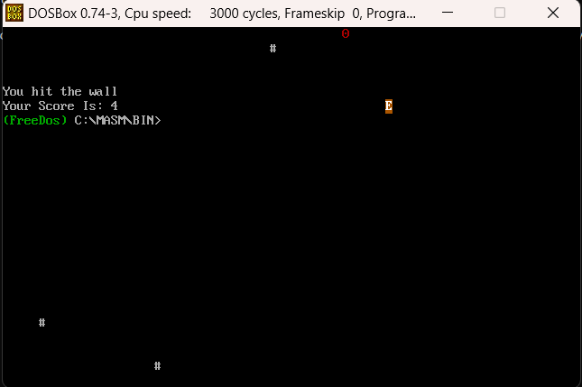
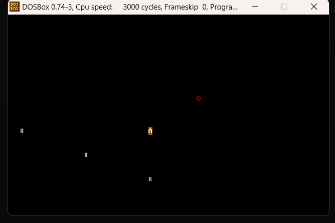

# Assembly Navigation Game

## Project Description
A navigation game written in **x86 Assembly (16-bit)** as part of a Microprocessors and Assembly Language course.  
The player controls a character on the screen, collects randomly generated points, and avoids walls and screen borders.  
The game demonstrates the use of **interrupts, real-time clock input, and direct video memory access**.  

## Gameplay
- Player starts at the center of the screen.  
- Movement is controlled with the **WASD keys**.  
- Each collected point increases the score and spawns a new one at a random location.  
- Random positions are generated using values from the **RTC (Real-Time Clock)**.  
- Walls are placed randomly on the screen and must be avoided.  
- The game ends when the player hits a wall, reaches the screen border, or presses **T**.  
- At the end, the final score is displayed.  

## Technical Details
- Written in **x86 Assembly, 16-bit real mode**.  
- Direct screen rendering via video memory at segment **B800h**.  
- Keyboard input through I/O ports **60h** and **64h**.  
- Random number generation using RTC registers **70h** and **71h**.  
- Timer interrupt handling for automatic movement and event timing.  

## How to Run
1. Assemble the code with **MASM** or **TASM**.  
2. Run the program in **DOSBox** or a **FreeDOS** environment.  
3. Control the player using **WASD keys**.  

## Screenshots
Here are screenshots of the game running:

  
  

